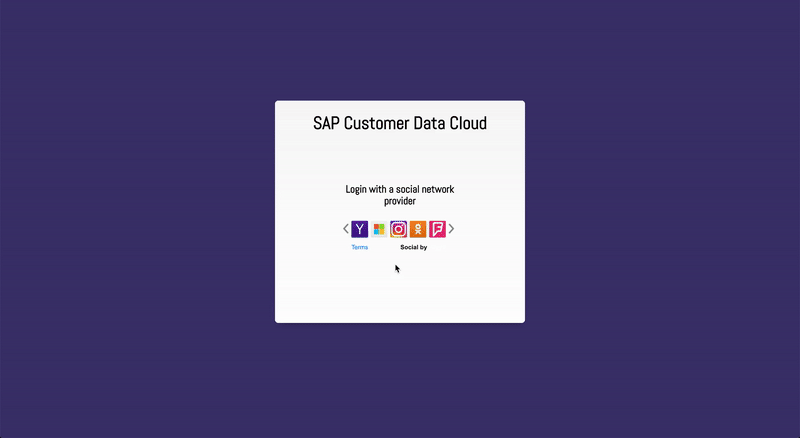

# Gigya Social Login JS Sample

This Web App is a demonstration of Gigya's Social Login API.

### Prerequisites

* `node` (ideally latest version)
* `npm` (ideally latest version)

### Start the dev server

* run `npm i` to install needed dev dependencies
* run `npm run dev` to start the development server
* The local address is copied to clipboard so navigate to it and click on `login.html` - if not in use already the addresses we are interested in are `http://localhost:5000/login` and `http://localhost:5000/welcome`

### Run tests (WIP)

* run `npm i` to install needed dev dependencies
* run `npm t` to start the development server
* test results will be shown on the console as well as coverage of the files
* coverage report can be found in browser as well on a generated file `coverage/lcov-report/index.html`

### Features

* Users can sign in using any of the social profiles supported by Gigya's API.
* During the login process if the user's email is not present in the User object given in the response from Gigya's API, the is prompted to provide his email address before redirecting to the next page
* `timesLoggedIn` cookie gets created the first time a user logs in having as initial value 1 which gets incremented every time the user logs back in the application. This cookie's expiration date is one year after the user's last log in.
* Once logged in the user gets a personalised greeting (depending if she is a new user or not) and is able to view useful information for his profile gathered during the sign in process.
* Once logged in the user is able to share a post and log out using Gigya's API.
* If the user tries to access the `/welcome` screen without having signed in yet, she will get redirected back to `/login`.

### Documentation

The project contains:
- 3 main directories: `public`, `src`, `test` (WIP) and `docs`
- `.babelrc` file to set the configuration of the javascript compilation
- `rollup.config.js` file to set the configuration of the project's bundling
- `jest.config.js` file to set the configuration of jest for testing
- `package.json` file with information about the project (dependencies needed, author, etc.)

#### `public` directory

The `public` directory contains the 2 main html files of this project:
- `login.html` is the starting screen. In this screen the user is able to select the social login that she would like to use to sign in.
- `welcome.html` contains useful information about the user, gathered from the login process. In addition to that in this screen the user is able to share a post and logout using Gigya's API.
The `public` directory also contains a `styles` directory with the css needed which is used in the `html` files.
Lastly the `public` directory contains the genrated javascript that is being used in the `html` files.

#### `src` directory

`src` contains the `javascript` modules and utility functions needed, as well as `login.js` and `welcome.js` which have the initialisation of the modules.

#### `test` directory

`test` contains the `javascript` unit tests for the application using `jest`. (WIP)

#### `docs` directory

`docs` contains documentation for the project. (eg. [User Stories](docs/user-stories.md)).

#### `.babelrc` file

`.babelrc` contains the configuration of the javascript compilation settings

#### `rollup.config.js` file

`rollup.config.js` contains the configuration of the javascript's bundling process

#### `jest.config.js` file

`jest.config.js` contains the configuration of jest for testing

#### `package.json` file

`package.json` contains information about the project (dependencies needed, author, etc.)

### MISSIONS

In `login.html` mission is to:
Run these pages with your favorite web server.
				
Tip: call up the page using localhost as the domain (this will allow the Gigya API key to work properly):
http://localhost/.../login.html

1) Add the Gigya login component showLoginUI within a container
2) After authentication, redirect to b.html
3) Bonus points: from the authentication response, if email is not
present in the User object, prompt the user to enter an email, then
redirect to b.html (no need to persist email, just ask for it)
(hint: you will need to use addEventHandlers for the onLogin event)
4) Bonus-bonus points: show some kind of counter or flag indicating how
many times the user has logged in (e.g., use a cookie or database).
(You can use whatever server-side or client-side implementation you want)

In `welcome.html` mission is to:
1) At first to enhance the user experience by providing more detail from input parameters
2) Add the Gigya connect component, showAddConnectionsUI, in a containing div
3) From the events generated by the connection component, indicate the connected
social network providers on the page (hint: you will need to use addEventHandlers)
4) Modify the logout (below) to use the Gigya logout API call
5) Bonus points: add a sharing experience, either via publishUserAction or showShareUI

(Note: while implementation is important, layout and user experience also matters.)
